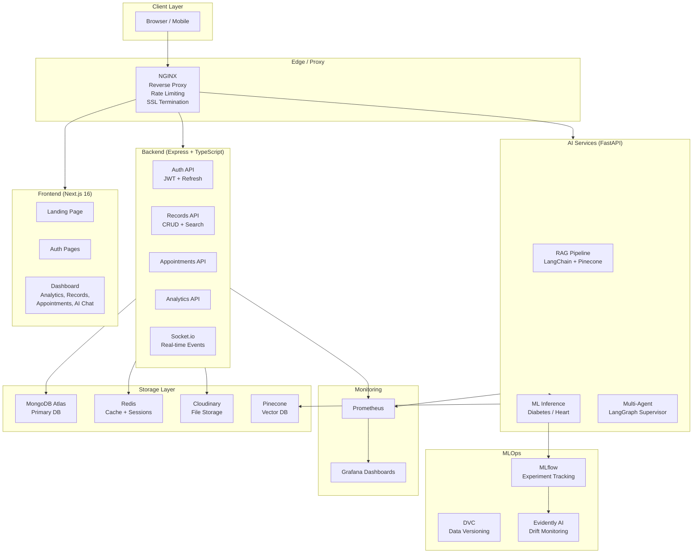
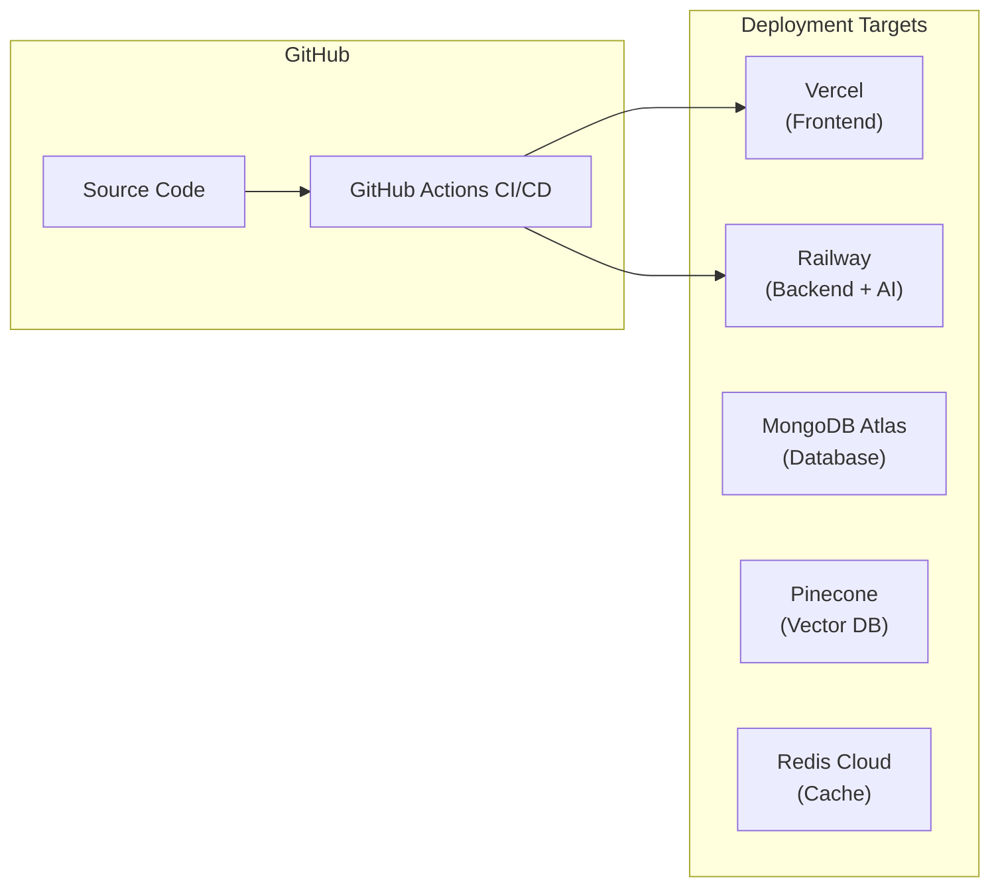

# MedNexus AI — Architecture & Deployment

## System Architecture



## Deployment Architecture



## CI/CD Pipeline

```
Push to main/develop
    │
    ├── Backend CI
    │   ├── npm install
    │   ├── TypeScript check (tsc --noEmit)
    │   ├── npm test (30 tests)
    │   └── npm run build
    │
    ├── Frontend CI
    │   ├── npm install
    │   ├── ESLint
    │   └── next build (12 routes)
    │
    ├── AI Services CI
    │   ├── pip install
    │   └── Python syntax + import check
    │
    └── ML Models CI
        ├── Train diabetes model (F1=0.91)
        ├── Train heart model (F1=0.86)
        └── Validate inference
            │
            └── [main branch only]
                ├── Docker build + push
                ├── Deploy to Railway (backend + AI)
                └── Deploy to Vercel (frontend)
```

## Environment Variables

```env
# Required for full functionality
MONGODB_URI=          # MongoDB Atlas connection string
JWT_SECRET=           # Min 32 chars, random
JWT_REFRESH_SECRET=   # Min 32 chars, different from JWT_SECRET
REDIS_URL=            # Redis connection URL

# For file uploads
CLOUDINARY_CLOUD_NAME=
CLOUDINARY_API_KEY=
CLOUDINARY_API_SECRET=

# For AI features
OPENAI_API_KEY=       # sk-... (for GPT-4 RAG)
GEMINI_API_KEY=       # (alternative to OpenAI)
PINECONE_API_KEY=     # Production vector store
PINECONE_INDEX=       # mednexus-medical
PINECONE_ENVIRONMENT= # us-east-1

# Frontend
NEXT_PUBLIC_API_URL=https://api.mednexus.ai/api/v1
NEXT_PUBLIC_AI_URL=https://ai.mednexus.ai
```

## Production Checklist

- [ ] Set `NODE_ENV=production`
- [ ] Use strong random JWT secrets (32+ chars)
- [ ] Configure MongoDB Atlas with IP allowlist
- [ ] Set up Cloudinary webhook for file processing
- [ ] Configure Pinecone index with 1536 dimensions (OpenAI) or 768 (HuggingFace)
- [ ] Enable MongoDB Atlas backups
- [ ] Configure Grafana alerts for latency > 500ms
- [ ] Set up Evidently AI drift alerts
- [ ] Configure NGINX SSL with Let's Encrypt
- [ ] Set up log rotation for Winston logs
- [ ] Seed admin account with strong password
