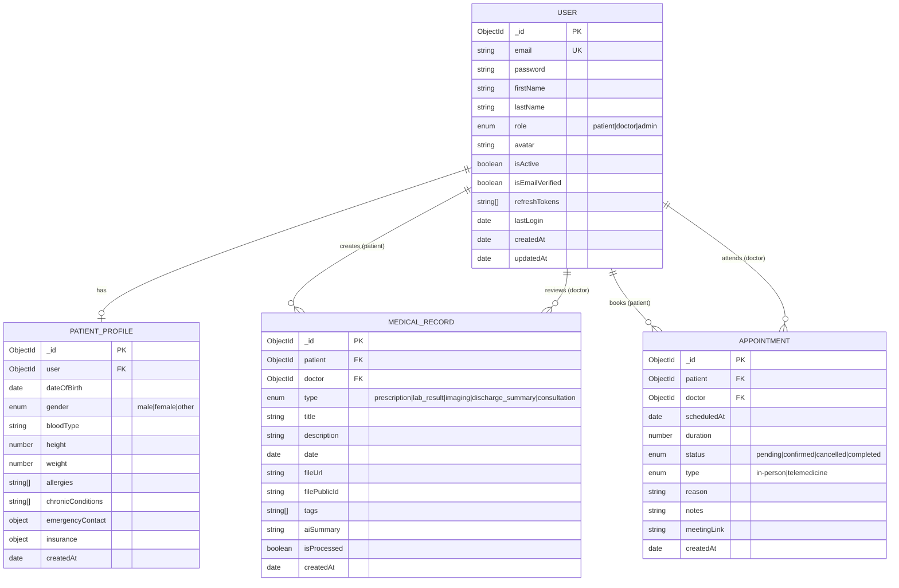

# MedNexus AI — Database Schema

## Entity Relationship Diagram



## Indexes

### User Collection
```javascript
{ email: 1 }             // unique
{ role: 1, isActive: 1 } // compound
{ createdAt: -1 }        // sort
```

### MedicalRecord Collection
```javascript
{ patient: 1, date: -1 }   // patient timeline
{ type: 1, patient: 1 }    // filter by type
{ tags: 1 }                // tag search
{ title: "text", description: "text" }  // full-text search
```

### Appointment Collection
```javascript
{ patient: 1, scheduledAt: -1 }   // patient appointments
{ doctor: 1, scheduledAt: 1 }     // doctor schedule
{ scheduledAt: 1, status: 1 }     // availability checks
```

## Redis Cache Keys

| Key Pattern | TTL | Description |
|-------------|-----|-------------|
| `analytics:dashboard:*` | 60s | Dashboard stats by role |
| `user:session:*` | 15m | Access token cache |
| `rate:auth:*` | 15m | Auth rate limit counters |

## Vector Store Schema (Pinecone)

```json
{
  "id": "doc_uuid_chunk_index",
  "values": [0.023, -0.14, ...],
  "metadata": {
    "record_id": "mongodb_id",
    "patient_id": "mongodb_id",
    "doc_type": "lab_result",
    "chunk_index": 2,
    "total_chunks": 8,
    "text": "Hemoglobin A1C: 7.2%...",
    "date": "2024-01-15",
    "tags": ["diabetes", "hba1c"]
  }
}
```
